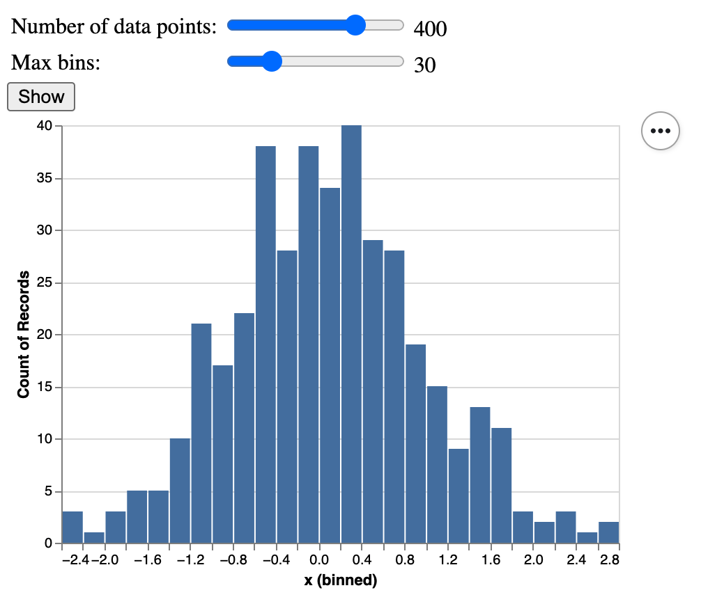

# Altair Flask Demo

This simple Python project illustrates how to use Flask to create interactive Altair plots.
The motivation is that even though Altair provides a lot of interactivity features,
it might be useful to create own HTML widgets, too.



A change in the plot can be invoked by either Show button or any of the sliders, 
although it's clear that it might not be necessary in real applications. 
For the sake of brevity, there are no CSS.

# Installation

Clone the project and then install the requirements.
It is possible to do it within a virtual environment as follows:

```shell
python3 -m venv venv
source venv/bin/activate
pip install -r requirements.txt
```

The application was tested with Python 3.8.

# How to run

Execute

```shell
FLASK_APP=altair_flask_demo/main.py flask run
```

and then open http://127.0.0.1:5000/ in your web browser.